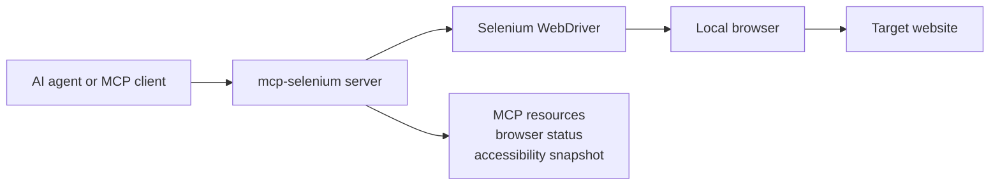

# MCP Selenium Server

[](https://www.npmjs.com/package/@rayven122/mcp-selenium)
[](https://www.npmjs.com/package/@rayven122/mcp-selenium)
[](LICENSE)

A Model Context Protocol (MCP) server for browser automation with Selenium
WebDriver. It lets MCP clients and AI agents drive real local browsers without
writing a separate Selenium script.

Use it to open a browser, navigate pages, click elements, fill forms, upload
files, handle alerts, manage cookies, capture diagnostics, take screenshots, and
inspect page structure through MCP.

## Highlights

- Published on npm as
  [`@rayven122/mcp-selenium`](https://www.npmjs.com/package/@rayven122/mcp-selenium).
- Works with Chrome, Firefox, Edge, Safari, and Edge in IE mode.
- Provides 18 MCP tools for browser automation and 2 MCP resources for browser
  status and accessibility snapshots.
- Captures console logs, JavaScript errors, and network activity through
  WebDriver BiDi when supported by the browser and driver.

## How It Works



## Setup

Choose the setup command for your MCP client. All examples run the published npm
package with `npx`, so you do not need to clone this repository just to use the
server.

<details open>
<summary><strong>Goose (Desktop)</strong></summary>

Paste into your browser address bar:

```
goose://extension?cmd=npx&arg=-y&arg=%40rayven122%2Fmcp-selenium&timeout=300&id=selenium-mcp&name=Selenium%20MCP&description=automates%20browser%20interactions
```
</details>

<details>
<summary><strong>Goose (CLI)</strong></summary>

```bash
goose session --with-extension "npx -y @rayven122/mcp-selenium"
```
</details>

<details>
<summary><strong>Claude Code</strong></summary>

```bash
claude mcp add selenium -- npx -y @rayven122/mcp-selenium
```
</details>

<details>
<summary><strong>Cursor / Windsurf / other MCP clients</strong></summary>

```json
{
  "mcpServers": {
    "selenium": {
      "command": "npx",
      "args": ["-y", "@rayven122/mcp-selenium"]
    }
  }
}
```
</details>

## Requirements

- Node.js 18 or newer and npm.
- At least one supported browser installed.
- The matching browser driver available to Selenium if your environment does
  not provide one automatically.

## Example Prompts

After adding the server to your MCP client, ask your AI agent something like:

> Open Chrome, go to example.com, and take a screenshot.

> Open Firefox, navigate to this signup page, fill the form, and submit it.

> Inspect the current page and summarize the interactive elements.

The agent can then call `start_browser`, `navigate`, and `take_screenshot`
through MCP. For most page inspection tasks, agents should prefer the
`accessibility://current` resource because it is smaller and easier to reason
about than full HTML or screenshots.

## Supported Browsers

| Browser | `start_browser` value | Headless support | Notes |
|---------|------------------------|------------------|-------|
| Chrome | `chrome` | Yes | Uses `--headless=new` when `options.headless` is true. |
| Firefox | `firefox` | Yes | Uses Firefox headless mode when requested. |
| Edge | `edge` | Yes | Uses `--headless=new` when `options.headless` is true. |
| Safari | `safari` | No | macOS only. Requires Safari remote automation. |
| Edge in IE mode | `edge-ie` | No | Windows only. Only exposed in the `start_browser` schema on Windows. Requires IEDriverServer and IE mode setup. |

<details>
<summary><strong>Safari setup</strong></summary>

Run this once on macOS:

```bash
sudo safaridriver --enable
```

Then enable "Allow Remote Automation" in Safari under Settings > Developer.

</details>

<details>
<summary><strong>Edge IE mode setup</strong></summary>

Edge IE mode is for legacy sites that must run through the Internet Explorer
engine inside Microsoft Edge. It requires:

- Windows.
- Microsoft Edge.
- IEDriverServer, preferably 32-bit, from the
  [Selenium downloads](https://www.selenium.dev/downloads/) on your `PATH`.
- IE mode enabled in Edge by policy or registry, with target sites configured
  for Internet Explorer mode.

Example:

```json
{
  "browser": "edge-ie",
  "options": {
    "ieIgnoreZoomSetting": true
  }
}
```

Optional Edge IE mode options include `edgePath` and `ieIgnoreZoomSetting`.

</details>

## Tools

Locator-based tools use the same locator strategies:

| Strategy | Description |
|----------|-------------|
| `id` | Find by element ID. |
| `css` | Find by CSS selector. |
| `xpath` | Find by XPath expression. |
| `name` | Find by `name` attribute. |
| `tag` | Find by tag name. |
| `class` | Find by class name. |

Most locator-based tools accept an optional `timeout` in milliseconds. The
default is `10000` unless noted otherwise.

| Tool | Purpose | Key parameters |
|------|---------|----------------|
| `start_browser` | Launch a browser session. | `browser`, optional `options` |
| `navigate` | Navigate to a URL. | `url` |
| `interact` | Click, double-click, right-click, or hover over an element. | `action`, `by`, `value`, optional `timeout` |
| `send_keys` | Clear an element, then type text into it. | `by`, `value`, `text`, optional `timeout` |
| `get_element_text` | Read visible text from an element. | `by`, `value`, optional `timeout` |
| `get_element_attribute` | Read an element attribute. | `by`, `value`, `attribute`, optional `timeout` |
| `press_key` | Press a keyboard key. | `key` |
| `upload_file` | Set a file input to an absolute file path. | `by`, `value`, `filePath`, optional `timeout` |
| `take_screenshot` | Capture the current page. | optional `outputPath` |
| `close_session` | Close the current browser session. | none |
| `execute_script` | Run JavaScript in the browser. | `script`, optional `args` |
| `window` | List, switch, switch to latest, or close windows and tabs. | `action`, optional `handle` |
| `frame` | Switch to a frame or back to the default page. | `action`, optional `by`, `value`, `index`, `timeout` |
| `alert` | Accept, dismiss, read, or type into browser dialogs. | `action`, optional `text`, `timeout` |
| `add_cookie` | Add a cookie for the current page domain. | `name`, `value`, optional cookie fields |
| `get_cookies` | Return all cookies or one cookie by name. | optional `name` |
| `delete_cookie` | Delete all cookies or one cookie by name. | optional `name` |
| `diagnostics` | Read BiDi console logs, JS errors, or network activity. | `type`, optional `clear` |

## Resources

MCP resources provide read-only data that clients can access without calling a
tool.

| Resource | MIME type | Requires browser | Description |
|----------|-----------|------------------|-------------|
| `browser-status://current` | `text/plain` | No | Current active session ID, or `no active session`. |
| `accessibility://current` | `application/json` | Yes | Compact accessibility tree of interactive elements and text content. |

## Development

```bash
git clone https://github.com/rayven122/mcp-selenium.git
cd mcp-selenium
npm install
npm test
```

Tests use Node's built-in test runner and talk to the real MCP server over
stdio. They require Chrome and `chromedriver` on your `PATH`.

Useful local checks:

```bash
npm run check
npm run audit
npm run pack:dry-run
```

This package is published to npm as `@rayven122/mcp-selenium`. The Setup
section above runs the latest published package with
`npx -y @rayven122/mcp-selenium`.

### Run from a local clone

For a pinned local copy (recommended when running on a fixed Windows host for
Edge IE mode), point your MCP client at the server entry directly:

```bash
node /absolute/path/to/mcp-selenium/src/lib/server.js
```

## License

MIT
